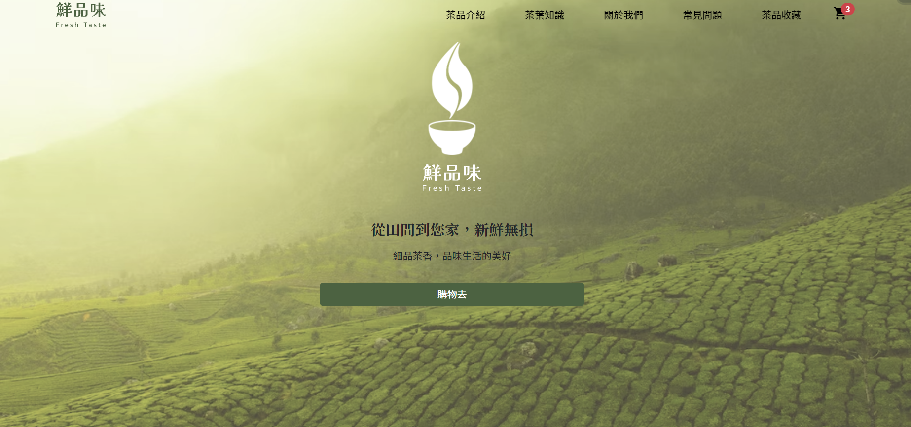
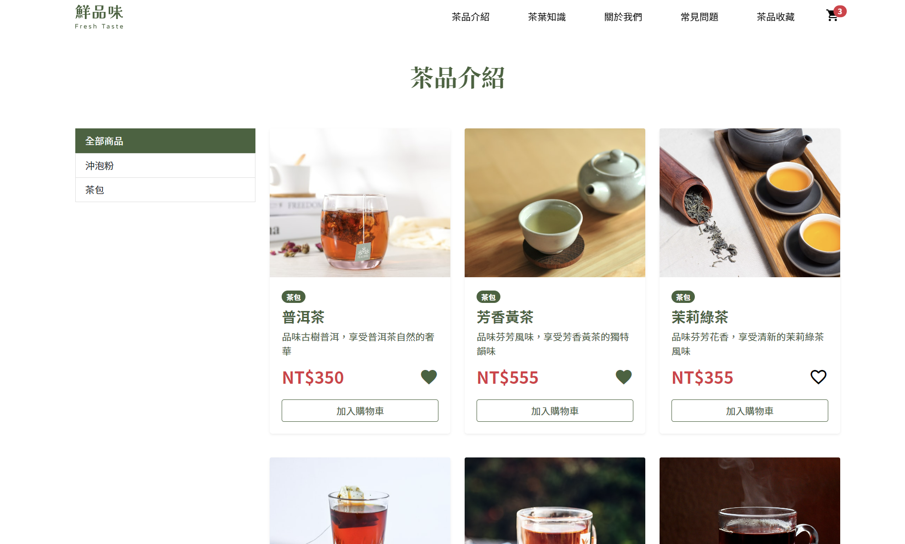

# 鮮品味茶葉飲品電子商務網站(flash-tea)

這是一個以茶葉為主題的單頁式電子商務類型網站專案，專案使用Vue 3 Vite前端框架來開發，搭配Boorstrap 5來開發。

* 前台

  * 商品分類瀏覽
  * 詳細商品介紹
  * 加入購物車
  * 收藏商品

* 後台

  * 商品上下架管理
  * 訂單管理
  * 折價卷管理
  * 文章管理

## Demo

[flash-tea](https://gp355d.github.io/flash-tea/#/)

## 專案環境

* Node.js v16.15.0
* Vue v3.2.45
* Vite v4.0.0
* Bootstrap v5.2.3

## 專案使用套件

* Bootstrap 5
* VeeValidate
* Swiper
* SweetAler 2
* CKEditor 5
* vue-loading-overlay
* AOS
* Axios
